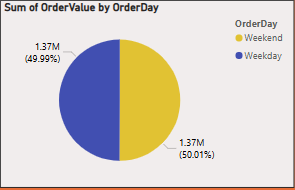
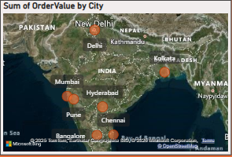
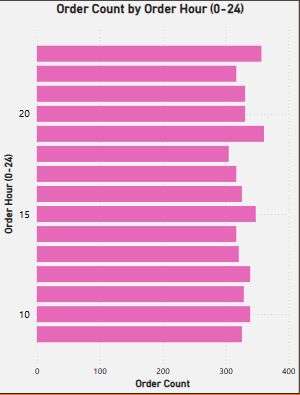

# swiggy_vs_zomato-report-project

**Project Overview**

Comparative Power BI analysis of Swiggy vs Zomato using key metrics like delivery time, customer rating, and order values. Data-driven insights for business strategy.

**Dataset**

- **Source** : Collected from social media platforms
- **Format** : CSV (Comma-Separated Values)
- **Rows** : 10,000+   
- **Fields** : OrderID, Platform, City, Restaurant, Cuisine, OrderValue, DeliveryTime, CustomerRating,OrderHour, OrderDay.

**Key Visuals**

- OrderValue by Cuisine : Donut Chart
- OrderValue by City : Map
- OrderValue by OrderDay : Pie Chart
- Order Count by Order Hour : Stacked Bar Chart
- Total Orders, Revenue, Partner Restaurant, Avg Delivery Time(min), Ratings : Card
- City : Slicer

**Visual Insights**

- OrderValue by Cuisine (Donut Chart)

- OrderValue by OrderDay (Pie Chart)

- OrderValue by City (Map)

- Order Count by Order Hour (Stacked Bar Chart)

